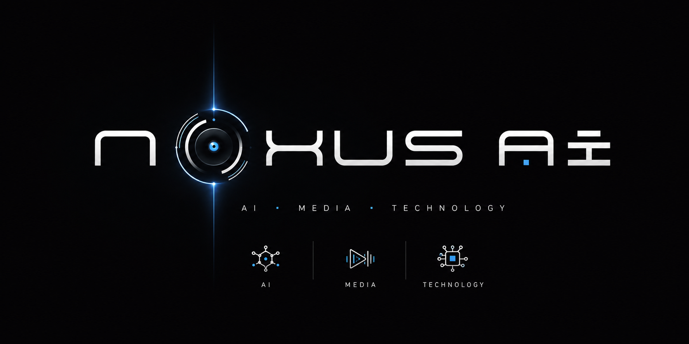
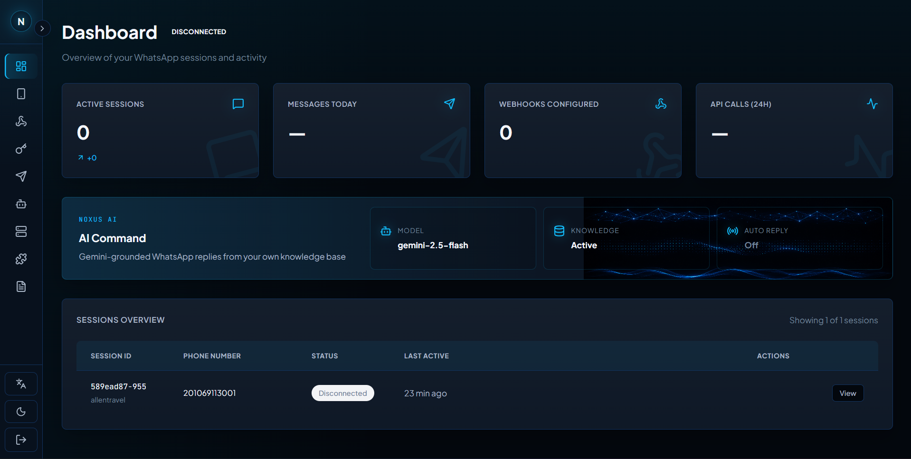
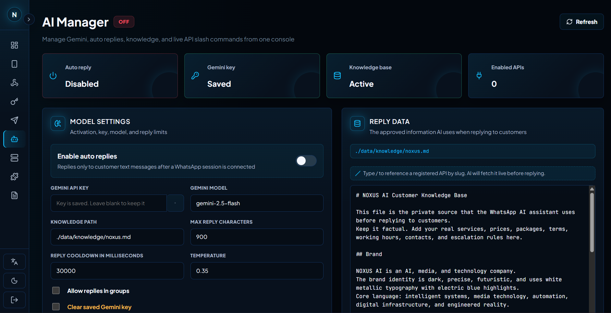
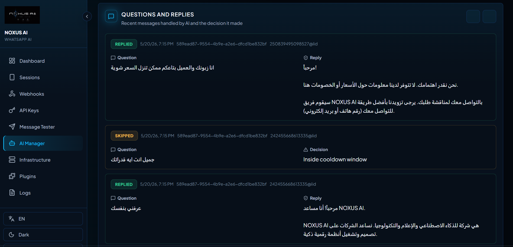

<p align="center">
  
</p>

<h1 align="center">NOXUS AI Open WhatsApp</h1>

<p align="center">
  <strong>AI-grounded WhatsApp operations platform — built for teams that want a real assistant on WhatsApp, not just an API gateway.</strong>
</p>

<p align="center">
  <a href="https://noxusai.online/"><b>noxusai.online</b></a> ·
  <a href="#why-noxus-ai-open-whatsapp">Why</a> ·
  <a href="#the-ai-stack">AI Stack</a> ·
  <a href="#api-slash-commands--the-killer-feature">API Slash</a> ·
  <a href="#laravel-integration">Laravel</a> ·
  <a href="#quick-start">Quick Start</a> ·
  <a href="#docs">Docs</a>
</p>

<p align="center">
  
  
  
  
  
  
  
  
</p>

<p align="center">
  
</p>

---

## Why NOXUS AI Open WhatsApp?

Most WhatsApp gateways stop at "send a message." **NOXUS AI Open WhatsApp** goes further: it ships a **grounded AI agent** that answers customers from your own knowledge — and can call your live APIs by slash command before replying.

You bring the data and the APIs. NOXUS does the WhatsApp, the AI, and the operations console.

|                                |                                                              |
| ------------------------------ | ------------------------------------------------------------ |
| **Grounded Gemini AI**         | Replies only from your knowledge base + live API context     |
| **API Slash Commands**         | Register APIs once, reference them in Reply Data with `/slug` |
| **Full WhatsApp REST API**     | Sessions, messages, media, groups, channels, labels         |
| **Operations Dashboard**       | React UI for sessions, AI, webhooks, infra, audit            |
| **100% Open Source**           | No vendor lock-in, no paywalls, MIT license                 |
| **Pluggable Architecture**     | Swap DB (SQLite/Postgres), cache, storage, engine            |
| **Docker Native**              | Production stack with one command                            |
| **Bilingual UI**               | English + Arabic, full RTL support                           |

> Hosted by us at **[noxusai.online](https://noxusai.online/)** · self-host with the steps below.

---

## The AI Stack

NOXUS ships with a real AI layer for WhatsApp customer support, not just an HTTP wrapper. It is **grounded** — the assistant is locked to your company-provided knowledge and live API responses.

### How a reply is generated

```
┌─────────────────┐    1. message      ┌──────────────────┐
│  WhatsApp user  │ ─────────────────► │   NOXUS engine   │
└─────────────────┘                    └────────┬─────────┘
                                                │ 2. extract /slugs from Reply Data
                                                ▼
                              ┌─────────────────────────────────────┐
                              │  Reply Data (your knowledge.md)     │
                              │  "Live menu and prices: /menu"      │
                              │  "Stock check: /stock"              │
                              └────────────┬────────────────────────┘
                                           │ 3. fetch live APIs in parallel
                                           ▼
                              ┌─────────────────────────────────────┐
                              │  /menu  → https://api.you/menu      │
                              │  /stock → https://api.you/stock?... │
                              └────────────┬────────────────────────┘
                                           │ 4. inject into prompt context
                                           ▼
                              ┌─────────────────────────────────────┐
                              │  Gemini (grounded) ─ company data + │
                              │  live API JSON + safety rules       │
                              └────────────┬────────────────────────┘
                                           │ 5. concise WhatsApp reply
                                           ▼
                              ┌─────────────────────────────────────┐
                              │  Sent back to the customer          │
                              └─────────────────────────────────────┘
```

### AI features

| Feature                          | What it does                                                                                       |
| -------------------------------- | -------------------------------------------------------------------------------------------------- |
| **Grounded auto-reply**          | Customers' messages are answered by Gemini, **only** from your Reply Data and live API responses   |
| **`/slug` API Slash Commands**   | Register external APIs in the dashboard; reference them inline from Reply Data as `/slug`          |
| **Live context injection**       | At reply time, every referenced API is fetched in parallel (6s timeout, 4 KB cap) and merged in    |
| **Per-API description**          | Each API carries a description so the model knows *what* it's for and *when* to lean on it         |
| **No-hallucination guardrail**   | If neither knowledge nor API context covers the question, AI says "the team will follow up"        |
| **Per-chat cooldown**            | Configurable cooldown per chat prevents reply storms (default 30s)                                 |
| **Group safety**                 | Group replies are off by default; flip a switch when you want them on                              |
| **Interaction log**              | Every question, decision (replied / skipped / failed) and reason persisted in `data/ai/`           |
| **Bilingual replies**            | The assistant mirrors the customer's language automatically (works great in EN/AR)                 |
| **Live test from dashboard**     | One-click "Test" probes any API, stores `lastStatus` + `lastError` + a 600-char response sample    |
| **Audit-friendly**               | API key, headers, request body all stored as JSON — no hidden config                               |

### API Slash Commands — the killer feature

Static knowledge files lie the moment your prices, stock, or schedule change. Slash commands fix that.

1. **Open the dashboard → AI Manager → APIs (slash commands) → Add API**
2. Give it a **slug** (e.g. `menu`), a **name**, a **description** ("Live restaurant menu and prices"), the **URL**, optional headers, and method.
3. Save and click **Test** — you'll see `HTTP 200`, response time, and a 600-char sample.
4. Open **Reply Data** and write your knowledge naturally, referencing the API with `/`:

   ```md
   Our hours are 10 AM – 11 PM, daily.

   The live menu and current prices are provided via /menu.
   For real-time stock on a specific item, use /stock.
   ```

5. Type `/` anywhere in Reply Data to open a picker that lists every registered API with its description — pick one to insert it.

At reply time, NOXUS scans your Reply Data for `/slug` tokens, fetches each enabled API in parallel, and slots the response into the prompt as `[API /menu] {…}` with the description, so Gemini knows what the data is and grounds its answer in it.

If an API is down, the model is told it failed and falls back to the "the team will follow up" guardrail rather than making something up.

> Endpoints: `GET /api/ai/apis`, `POST /api/ai/apis`, `PUT /api/ai/apis/:id`, `DELETE /api/ai/apis/:id`, `POST /api/ai/apis/:id/test`

---

## The Operations Dashboard

A modern React 19 + Vite + TanStack Query dashboard with full English/Arabic + RTL support. Every module is a real first-class page, not a settings panel.

<p align="center">
  
  <br/>
  <sub><em>Dashboard — live overview of sessions, messages, webhooks, and AI status</em></sub>
</p>

| Module               | What you can do from it                                                                  |
| -------------------- | ---------------------------------------------------------------------------------------- |
| **Dashboard**        | Live overview: active sessions, messages today, webhooks, AI status                      |
| **Sessions**         | Create/start/stop WhatsApp sessions, scan QR codes, see live status                      |
| **Message Tester**   | Send text/media to any chat and see the result without writing code                      |
| **AI Manager**       | Configure Gemini, edit Reply Data with the `/` picker, register APIs, view AI log        |
| **Webhooks**         | HMAC-signed webhooks per session, granular event subscription                            |
| **API Keys**         | Role-based keys (`admin` / `operator` / `viewer`), IP allowlists, session scoping, expiry |
| **Infrastructure**   | Switch DB / cache / storage / engine without editing code, persist to `.env`             |
| **Plugins**          | Toggle pluggable engines (whatsapp-web.js, future Baileys), per-plugin config            |
| **Logs**             | Paginated audit trail across the platform, filterable by severity                        |

### Screenshots

<p align="center">
  
  <br/>
  <sub><b>AI Manager</b> — Gemini settings + Reply Data with the <code>/</code> picker for live API slash commands</sub>
</p>

<p align="center">
  
  <br/>
  <sub><b>AI Interactions Log</b> — every question, decision and reason. The assistant mirrors the customer's language automatically (Arabic / RTL shown).</sub>
</p>

---

## Platform Features

### Messaging & WhatsApp

| Feature             | Status | Notes                                            |
| ------------------- | ------ | ------------------------------------------------ |
| Text Messages       | ✅     | Single + bulk send                               |
| Media Messages      | ✅     | Images, video, documents, audio, voice notes    |
| Message Reactions   | ✅     | Emoji reactions to inbound and outbound messages |
| Read / Typing       | ✅     | Read receipts, typing/recording indicators       |
| Groups API          | ✅     | Create, manage participants, mute, message       |
| Channels/Newsletter | ⚠️     | Engine-limited; verify with your WhatsApp account |
| Labels              | ✅     | Organise chats with native WhatsApp labels       |
| Status/Stories      | ❌     | Not implemented in the current whatsapp-web.js adapter |
| Catalog             | ❌     | Not implemented in the current whatsapp-web.js adapter |
| Multi-Session       | ✅     | Multiple WhatsApp accounts on one instance       |

### AI

| Feature                | Status | Notes                                                                 |
| ---------------------- | ------ | --------------------------------------------------------------------- |
| Gemini Auto-Reply      | ✅     | Grounded on your Reply Data                                           |
| API Slash Commands     | ✅     | `/slug` tokens fetched live before each reply                         |
| Per-chat cooldown      | ✅     | Default 30 s, configurable                                            |
| Interaction log        | ✅     | Persistent JSONL audit of every decision                              |
| Bilingual replies      | ✅     | Mirrors the customer's language                                       |
| System prompt          | ✅     | Edit the system instruction from the dashboard                        |
| OpenAI / Claude / Local| ❌     | Not yet — Gemini-first; pluggable provider layer planned              |

### Platform

| Feature             | Status | Notes                                            |
| ------------------- | ------ | ------------------------------------------------ |
| REST API            | ✅     | Full HTTP surface, Swagger at `/api/docs`        |
| Webhooks            | ✅     | Per-session, HMAC-signed                         |
| API Key Auth        | ✅     | `admin` / `operator` / `viewer`, IP allowlist + session scope |
| Audit Logging       | ⚠️     | Core session actions tracked; broader coverage planned |
| Rate Limiting       | ✅     | Per-window configurable limits                   |
| CIDR Whitelisting   | ✅     | IP-based access control                          |
| Proxy Support       | ✅     | Per-session proxy configuration                  |

### Infrastructure

| Feature             | Status | Notes                                            |
| ------------------- | ------ | ------------------------------------------------ |
| SQLite              | ✅     | Zero-config embedded database                    |
| PostgreSQL          | ✅     | Production-grade, optional built-in container    |
| Redis Cache         | ✅     | Optional performance caching                     |
| S3 / MinIO Storage  | ✅     | Scalable media storage                           |
| Docker Compose      | ✅     | One-command deployment                           |
| Health Checks       | ✅     | Kubernetes-ready probes                          |
| Data Migration      | ✅     | Export/import between backends                   |

---

## Quick Start

### Option A — Docker (recommended)

```bash
git clone https://github.com/rmyndharis/OpenWA.git noxus
cd noxus
docker compose -f docker-compose.dev.yml up -d
```

- Dashboard: **http://localhost:2886**
- API:       **http://localhost:2785/api**
- Swagger:   **http://localhost:2785/api/docs**

### Option B — Local dev

```bash
git clone https://github.com/rmyndharis/OpenWA.git noxus
cd noxus
npm install            # also installs the dashboard
npm run dev            # starts API + dashboard, config auto-generated
```

Open **http://localhost:2886** → log in with the API key printed in the console → go to **AI Manager** to set up Gemini.

---

## First 5 Minutes With the AI

1. **AI Manager → Settings** → paste your Gemini key, enable auto-reply, save.
2. **AI Manager → APIs** → click **Add API**, register your first endpoint:
   - **Slug:** `prices`
   - **Name:** Live prices
   - **Description:** Returns the current price list as JSON.
   - **URL:** `https://your.api/prices`
   - Click **Test** — confirm HTTP 200.
3. **AI Manager → Reply Data** → write your knowledge in natural language and reference the API:
   ```md
   We are open daily, 10 AM – 11 PM.
   Our up-to-date prices are provided via /prices.
   ```
4. **Sessions** → start a session, scan the QR with WhatsApp.
5. Message that number from another phone — NOXUS will reply using your knowledge + live `/prices` response, in the customer's language.

---

## Production Deployment

```bash
docker compose up -d                       # SQLite, local storage
docker compose --profile postgres up -d    # + PostgreSQL
docker compose --profile full up -d        # PostgreSQL + Redis + Dashboard + Traefik
```

| Profile          | Adds                  |
| ---------------- | --------------------- |
| `postgres`       | PostgreSQL database   |
| `redis`          | Redis cache           |
| `minio`          | S3-compatible storage |
| `with-dashboard` | Web dashboard         |
| `with-proxy`     | Traefik reverse proxy |
| `full`           | All of the above      |

| Service   | Port            | Description              |
| --------- | --------------- | ------------------------ |
| API       | `2785`          | REST API endpoints       |
| Dashboard | `2886`          | Web management interface |
| Swagger   | `2785/api/docs` | Interactive API docs     |

---

## API Examples

### Send a text message

```bash
curl -X POST http://localhost:2785/api/sessions/{sessionId}/messages/send-text \
  -H "Content-Type: application/json" \
  -H "X-API-Key: YOUR_API_KEY" \
  -d '{ "chatId": "628123456789@c.us", "text": "Hello from NOXUS!" }'
```

### Register an AI API slash command

```bash
curl -X POST http://localhost:2785/api/ai/apis \
  -H "Content-Type: application/json" \
  -H "X-API-Key: YOUR_API_KEY" \
  -d '{
    "slug": "menu",
    "name": "Live menu",
    "description": "Returns the live restaurant menu and prices as JSON.",
    "url": "https://api.yourbiz.com/menu",
    "method": "GET",
    "headers": { "Authorization": "Bearer xyz" },
    "enabled": true
  }'
```

### Update the AI Reply Data (knowledge)

```bash
curl -X PUT http://localhost:2785/api/ai/knowledge \
  -H "Content-Type: application/json" \
  -H "X-API-Key: YOUR_API_KEY" \
  -d '{
    "content": "We open daily 10 AM – 11 PM.\nThe live menu is provided via /menu."
  }'
```

### Probe an API slash command

```bash
curl -X POST http://localhost:2785/api/ai/apis/{id}/test \
  -H "X-API-Key: YOUR_API_KEY"
```

### Setup a webhook

```bash
curl -X POST http://localhost:2785/api/sessions/{sessionId}/webhooks \
  -H "Content-Type: application/json" \
  -H "X-API-Key: YOUR_API_KEY" \
  -d '{
    "url": "https://your-server.com/webhook",
    "events": ["message.received", "session.status"],
    "secret": "your-hmac-secret"
  }'
```

---

## Laravel Integration

OpenWA can be used from Laravel through normal HTTP requests. The recommended setup is:

- Create an OpenWA API key with the `operator` role.
- Restrict that key to your Laravel server IP and the target WhatsApp session.
- Store OTP generation and verification in Laravel; use OpenWA only as the WhatsApp delivery channel.
- Queue notification sends and keep SMS/email as a fallback for critical OTP flows.

Minimal Laravel send example:

```php
use Illuminate\Support\Facades\Http;

Http::baseUrl(config('services.openwa.url'))
    ->withHeaders(['X-API-Key' => config('services.openwa.key')])
    ->post('/api/sessions/'.config('services.openwa.session_id').'/messages/send-text', [
        'chatId' => preg_replace('/\D+/', '', $phone).'@c.us',
        'text' => "Your verification code is {$otp}",
    ])
    ->throw();
```

Full Laravel setup, notification channel, OTP example, and webhook HMAC verification are documented in [docs/23-laravel-integration.md](docs/23-laravel-integration.md).

---

## Tech Stack

| Layer         | Technology                                    |
| ------------- | --------------------------------------------- |
| **Runtime**   | Node.js 22 LTS                                |
| **Backend**   | NestJS 11 · TypeScript 5 · TypeORM            |
| **AI**        | Google Gemini (`@google/genai`), grounded     |
| **Frontend**  | React 19 · Vite · TanStack Query · i18next    |
| **WA Engine** | whatsapp-web.js (pluggable engine layer)      |
| **Database**  | SQLite · PostgreSQL                           |
| **Cache**     | Redis (optional)                              |
| **Storage**   | Local · S3 · MinIO                            |
| **Container** | Docker + Docker Compose                       |

---

## Project Structure

```
noxus-ai-open-whatsapp/
├── src/
│   ├── main.ts                  # Bootstrap
│   ├── app.module.ts            # Root module
│   ├── config/                  # Configuration loaders
│   ├── common/                  # Cache, storage, shared utilities
│   ├── core/                    # Hooks + plugin system
│   ├── engine/                  # WhatsApp engine abstraction
│   └── modules/
│       ├── ai/                  # Gemini reply + API-link slash commands
│       │   ├── ai-reply.service.ts
│       │   ├── ai-api-links.service.ts
│       │   ├── ai-api-links.controller.ts
│       │   └── ai.controller.ts
│       ├── session/             # Session management
│       ├── message/             # Message handling
│       ├── webhook/             # Webhooks
│       ├── group/               # Groups API
│       ├── contact/             # Contacts
│       ├── auth/                # API keys + roles
│       ├── infra/               # Infrastructure config
│       └── health/              # Health probes
├── dashboard/                   # React dashboard
│   └── src/pages/AiManager.tsx  # AI + APIs slash UI
├── data/
│   ├── ai/
│   │   ├── settings.json        # Runtime AI settings
│   │   ├── api-links.json       # Registered API slash commands
│   │   └── interactions.jsonl   # AI decision audit log
│   └── knowledge/
│       └── noxus.md             # Reply Data (default path)
└── docs/                        # In-repo documentation
```

---

## Docs

| Document                                                | Description                       |
| ------------------------------------------------------- | --------------------------------- |
| [Project Overview](./docs/01-project-overview.md)       | Introduction and goals            |
| [Requirements](./docs/02-requirements-specification.md) | Feature specifications            |
| [Architecture](./docs/03-system-architecture.md)        | System design                     |
| [Security](./docs/04-security-design.md)                | Security implementation           |
| [Database](./docs/05-database-design.md)                | Data models and migrations        |
| [API Spec](./docs/06-api-specification.md)              | Complete API reference            |
| [Development](./docs/08-development-guidelines.md)      | Coding standards                  |
| [AI Setup](./docs/ai-gemini-setup.md)                   | Gemini key + Reply Data setup     |
| [Migration Guide](./docs/14-migration-guide.md)         | Database & storage migration      |

---

## Contributing

1. Fork the repo
2. Branch: `git checkout -b feature/your-feature`
3. Commit and push
4. Open a PR

Please read the [Development Guidelines](./docs/08-development-guidelines.md).

---

## License

MIT — free for personal and commercial use. See [LICENSE](./LICENSE).

---

<div align="center">


**NOXUS AI Open WhatsApp** — AI-grounded WhatsApp, open source.

[noxusai.online](https://noxusai.online/) · [Docs](./docs/README.md) · [API Docs](http://localhost:2785/api/docs) · [Issues](https://github.com/rmyndharis/OpenWA/issues)

</div>
>>>>>>> 5c1c002 (docs: add project documentation and assets)
